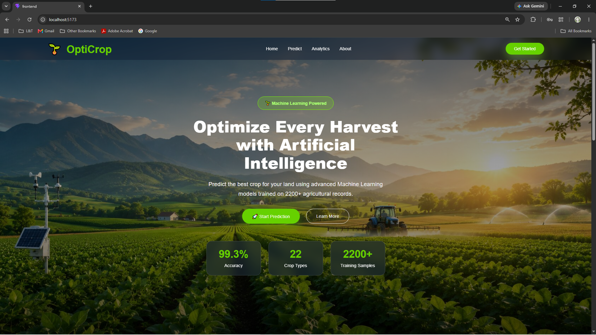
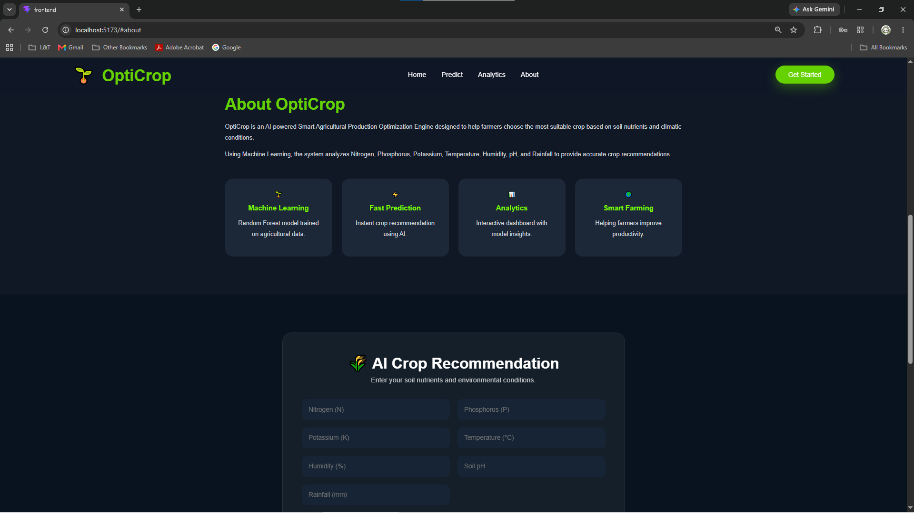
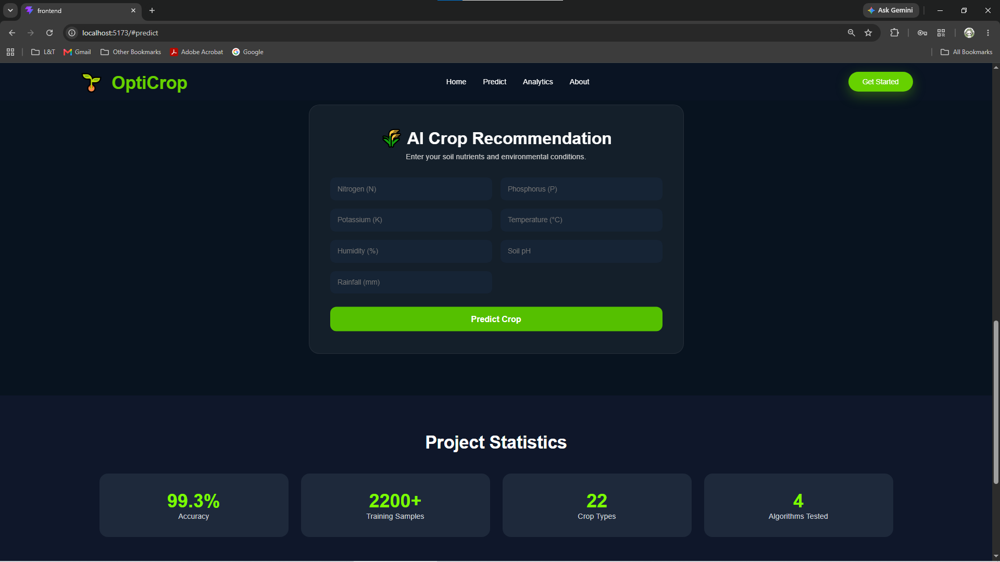
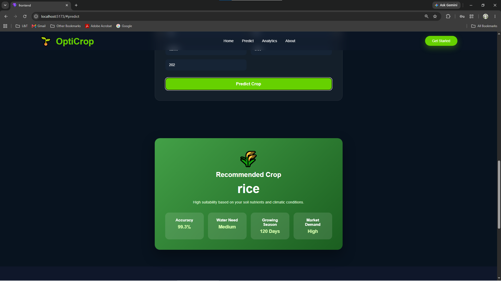
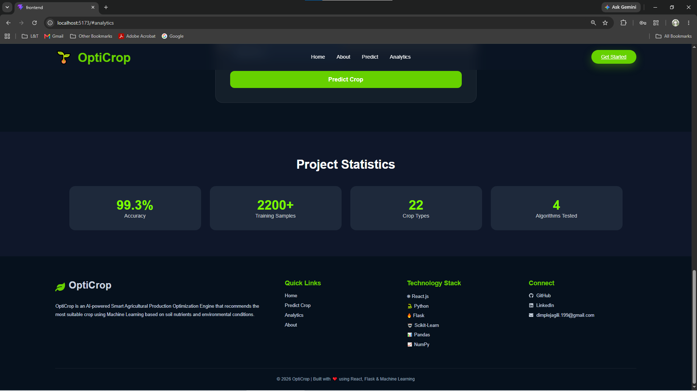

# 🌱 OptiCrop: Smart Agricultural Production Optimization Engine

## 📖 Overview

OptiCrop is an AI-powered crop recommendation system developed using **Machine Learning**, **Flask**, and **React**. The application recommends the most suitable crop based on soil nutrients and environmental conditions, helping farmers make informed decisions that improve productivity and promote sustainable agriculture.

The system analyzes the following agricultural parameters:

- Nitrogen (N)
- Phosphorous (P)
- Potassium (K)
- Temperature
- Humidity
- pH Value
- Rainfall

Based on these inputs, a trained **Random Forest Machine Learning model** predicts the most suitable crop.

---

# 🎯 Problem Statement

Selecting the right crop for cultivation is a major challenge due to changing environmental conditions and varying soil quality. Traditional farming methods often rely on experience, which may not always produce optimal results.

OptiCrop addresses this challenge by using machine learning to analyze soil nutrients and climatic conditions, providing intelligent crop recommendations that improve agricultural productivity.

---

# 🚀 Features

- 🌾 AI-Based Crop Recommendation
- 🤖 Random Forest Machine Learning Model
- 📊 Agricultural Data Analysis
- 🔍 Input Validation
- 🌐 Flask REST API
- ⚛ React Frontend
- 📱 Responsive User Interface
- ⚡ Real-Time Crop Prediction

---

# 🛠️ Technology Stack

## Programming Languages

- Python
- JavaScript
- HTML5
- CSS3

## Machine Learning

- Scikit-learn
- Pandas
- NumPy
- Matplotlib
- Seaborn

## Backend

- Flask

## Frontend

- React.js
- Vite
- Axios

## Development Tools

- Visual Studio Code
- Jupyter Notebook
- Git
- GitHub

---

# 📂 Project Structure

```text
OptiCrop/
│
├── backend/
│   ├── dataset/
│   ├── model/
│   ├── notebooks/
│   ├── static/
│   ├── templates/
│   ├── app.py
│   └── requirements.txt
│
├── frontend/
│   ├── public/
│   ├── src/
│   ├── package.json
│   └── vite.config.js
│
├── docs/
├── screenshots/
├── assets/
│
├── README.md
├── package.json
├── package-lock.json
├── LICENSE
└── .gitignore
```

---

# ⚙️ Installation

## 1. Clone the Repository

```bash
git clone https://github.com/Dimple1603/OptiCrop.git
```

---

## 2. Backend Setup

```bash
cd backend
pip install -r requirements.txt
python app.py
```

The Flask server will start at:

```text
http://127.0.0.1:5000
```

---

## 3. Frontend Setup

```bash
cd frontend
npm install
npm run dev
```

The React application will start at:

```text
http://localhost:5173
```

---

# 📷 Application Screenshots

## 🏠 Home Page



---

## ℹ️ About Section



---

## 🌱 Crop Prediction Form



---

## ✅ Prediction Result



---

## 📊 Analytics Dashboard



---

# 📊 Machine Learning Workflow

1. Data Collection
2. Data Preprocessing
3. Feature Selection
4. Model Training
5. Model Evaluation
6. Model Deployment
7. Real-Time Crop Prediction

---

# 🎯 Objectives

- Recommend the best crop for a given soil condition.
- Improve agricultural productivity using Artificial Intelligence.
- Assist farmers in making data-driven decisions.
- Promote sustainable farming practices.
- Demonstrate the practical application of Machine Learning in agriculture.

---

# 🌍 Future Scope

- 🌦️ Weather API Integration
- 🧪 Fertilizer Recommendation System
- 🌿 Plant Disease Detection
- 📱 Android Application
- ☁️ Cloud Deployment
- 🌐 Multi-language Support

---

# 👨‍💻 Team Members

- **Dimple Kumar Jagili** *(Team Lead)*
- Yaganti Sreevardhan Reddy
- Kummari Deepthi
- Gajulapalli Sreenidhii
- Pandugayala Venkata Bhanu Siva Teja

---

# 🎓 Internship

This project was developed as part of the **APSCHE AI & ML Virtual Internship Program** under the **Artificial Intelligence & Machine Learning Track**.

---

# 📜 License

This repository is intended for **educational purposes** as part of the APSCHE AI & ML Virtual Internship Project.

---

## ⭐ Support

If you found this project helpful, consider giving this repository a **⭐ Star** on GitHub.